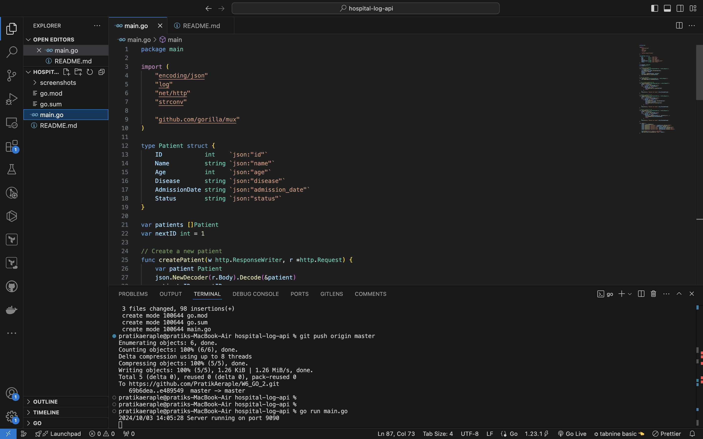
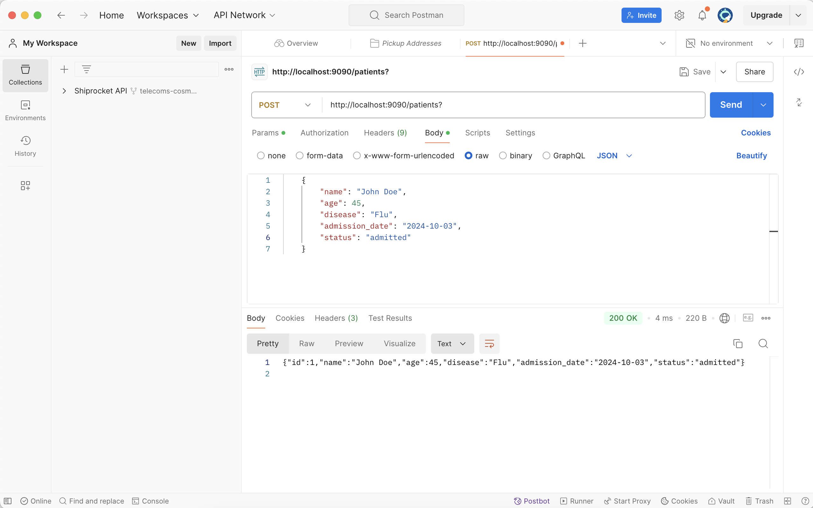
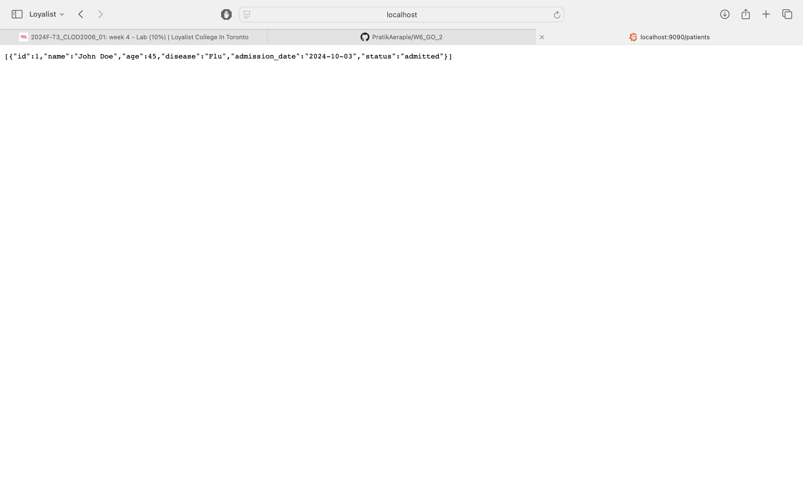
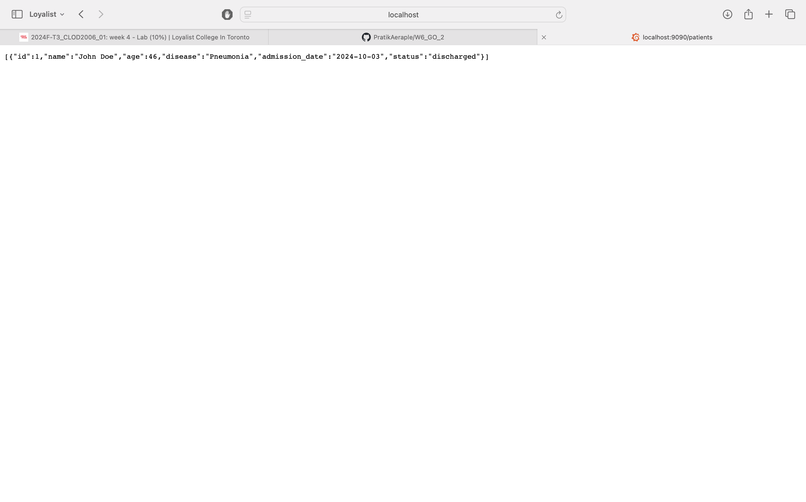
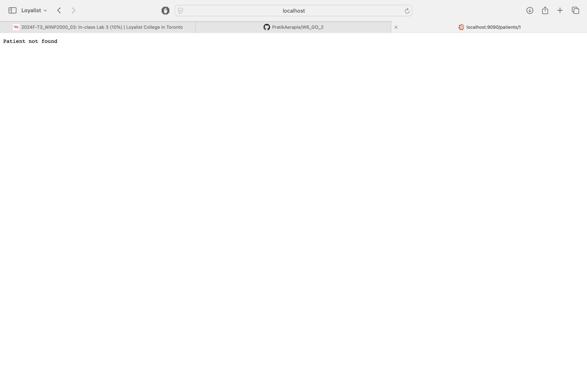

# Hospital Patient Log Book API

This API allows you to perform basic CRUD operations on a hospital patient log book. Below are the available API endpoints:

## 1. Create Patient (POST)
- **URL**: `http://localhost:9090/patients`
- **Response**:
    - Successfully running Server on port 9090

- **VS Code Screenshot**:


---

## 2. Get All Patients (GET)
- **URL**: `http://localhost:9090/patients`
- **Method**: GET
- **Request Body** (JSON example):
    ```json
    {
        "name": "John Doe",
        "age": 45,
        "disease": "Flu",
        "admission_date": "2024-10-03",
        "status": "admitted"
    }
    ```
- **Response**:
    - On success, it returns a list of all patients in JSON format.

- **Postman Screenshot**:


---

## 3. Get Patient by ID (GET)
- **URL**: `http://localhost:9090/patients/{id}`
- **Method**: GET
- **Example**:
    - `http://localhost:9090/patients/1` to get the patient with ID 1.
- **Response**:
    - On success, it returns the patient record in JSON format.
    - If the patient is not found, a 404 error is returned.

- **Postman Screenshot**:


---

## 4. Update Patient (PUT)
- **URL**: `http://localhost:9090/patients/{id}`
- **Method**: PUT
- **Example**:
    - `http://localhost:9090/patients/1` to update the patient with ID 1.
- **Request Body** (JSON example):
    ```json
    {
        "name": "John Doe",
        "age": 46,
        "disease": "Pneumonia",
        "admission_date": "2024-10-03",
        "status": "discharged"
    }
    ```
- **Response**:
    - On success, it returns the updated patient record.
    - If the patient is not found, a 404 error is returned.

- **Postman Screenshot**:


---

## 5. Delete Patient (DELETE)
- **URL**: `http://localhost:9090/patients/{id}`
- **Method**: DELETE
- **Example**:
    - `http://localhost:9090/patients/1` to delete the patient with ID 1.
- **Response**:
    - On success, it returns a 'Patient not found' response.
    - If the patient is not found, a 404 error is returned.

- **Postman Screenshot**:


---